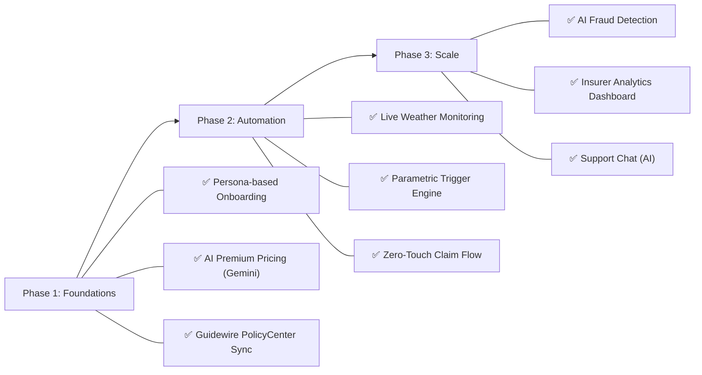
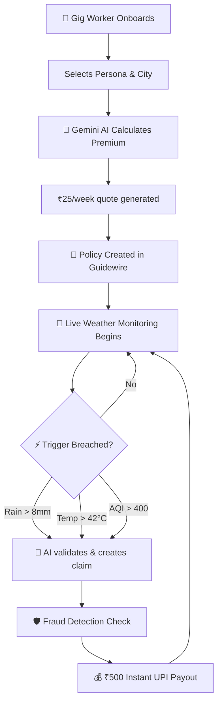

# SurakshaPay AI — 2-Minute Project Brief

> **Tagline**: AI-powered parametric income protection for India's 300M+ gig workers.
> **Built for**: Guidewire DEVTrails 2026 Hackathon

---

## 🎯 Vision & Strategy

### The Problem
India's platform delivery partners (Zomato, Swiggy, Zepto, Amazon, etc.) lose **20–30% of monthly earnings** when extreme weather, pollution, curfews, or zone closures prevent them from working. There is **no structured safety net** for these uncontrollable events — traditional insurance is too slow, too paper-heavy, and completely misaligned with the gig economy's pace.

### Our Solution
**SurakshaPay AI** is a **zero-touch, parametric income protection layer** that:

| Traditional Insurance | SurakshaPay AI |
|---|---|
| Monthly/annual premiums | **Weekly micro-premiums** (₹15–₹40/week) |
| Manual claim filing | **Automated parametric triggers** |
| Weeks to settle | **4.2 min avg payout time** |
| One-size-fits-all | **AI-personalized risk pricing** |

> 🔒 **Golden Rule**: We insure **LOSS OF INCOME ONLY** — no health, life, accident, or vehicle repair. Fully aligned with DEVTrails constraints.

---

## 🗺️ Roadmap — How We Built It

### Phase 1 — Foundations ✅
- **Onboarding**: Workers pick their persona (Food/Grocery/E-commerce) and city
- **AI-Powered Pricing**: Gemini 2.5 Flash analyzes historical weather, traffic & disruption data to generate a personalized weekly premium
- **Guidewire Integration**: Policy synced to Guidewire PolicyCenter on activation

### Phase 2 — Automation ✅
- **Live Weather Monitoring**: Real-time data from Open-Meteo for 6 Indian cities (Mumbai, Delhi, Bangalore, Hyderabad, Chennai, Kolkata)
- **Parametric Trigger Engine**: Auto-detects breaches (Rain > 8mm, Temp > 42°C, AQI > 400, Wind > 20 m/s)
- **Zero-Touch Claims**: When a trigger fires → claim auto-created in Guidewire ClaimCenter → instant ₹500 UPI payout

### Phase 3 — Scale & Optimize ✅
- **AI Fraud Detection**: Gemini-powered agent with tools for GPS spoofing detection, duplicate claim checks, and activity validation
- **Insurer Analytics Dashboard**: Loss ratios, payout trends, predictive risk alerts, portfolio breakdown
- **AI Support Chat**: Natural language assistant for policy queries

---

## 🛠️ Tech Stack

| Layer | Technology |
|---|---|
| **Frontend** | Next.js 15, React 19, TailwindCSS, ShadCN UI |
| **Backend** | Next.js API Routes, MongoDB, Mongoose |
| **AI Orchestration** | Genkit 1.x |
| **AI Model** | Google Gemini 2.5 Flash |
| **Insurance Platform** | Guidewire Cloud (PolicyCenter + ClaimCenter) |
| **Weather Data** | Open-Meteo API (live) |
| **Deployment** | Firebase App Hosting |

---

## 🔄 Core Workflow (End-to-End)

---

## 🎬 Prototype Demonstration

### Live App Walkthrough

The following screens prove core functionality across the **complete user journey**:

### 1. Landing Page
- Hero section with "Protect My Income" CTA
- Animated disruption detection badge ("₹500 Paid")
- Platform partner trust indicators

### 2. Onboarding Flow (4 Steps)
- **Step 1**: Personal details (name, phone, email)
- **Step 2**: Persona selection (Food/Grocery/E-commerce) + City picker
- **Step 3**: AI-generated premium quote with risk factors & explanation
- **Step 4**: Policy activated with Guidewire PolicyCenter ID

### 3. Worker Dashboard
- Active policy card with Guidewire ID
- Live weather watch for the worker's city
- Payout history with claim IDs
- Quick actions: AI Chat, Live Triggers, Admin

### 4. Live Weather & Triggers Page
- Real-time weather cards for 6 Indian cities
- Active parametric alerts with severity badges
- Trigger threshold documentation
- Auto-refresh every 5 minutes

### 5. Insurer Admin Dashboard
- KPI cards: Active Policies, Total Premiums, Loss Ratio, Fraud Prevention
- Weekly payout area chart
- Predictive risk alerts (Mumbai Monsoon 92%, Delhi Heat 74%)
- AI Fraud analytics panel
- Simulation buttons to test Rain/Heat triggers

### 6. AI Support Chat
- Natural language policy assistance
- Powered by Gemini 2.5 Flash via Genkit

---

## 🏆 Key Differentiators

1. **Zero-Touch Claims** — No forms, no calls, no waiting. Triggers are data-driven and instant.
2. **AI-Personalized Pricing** — Every worker gets a unique premium based on their city, persona, and real risk data.
3. **Guidewire-Native** — Full PolicyCenter & ClaimCenter integration, not a side system.
4. **Weekly Micro-Premiums** — Aligned with gig economy payout cycles (as low as ₹15/week).
5. **Fraud-Resistant** — AI agent with GPS spoofing detection and duplicate claim prevention.
6. **Live Data** — Real weather APIs, not simulated data. Triggers fire on actual conditions.

---

*Developed for **Guidewire DEVTrails 2026** by Team SurakshaPay.*
